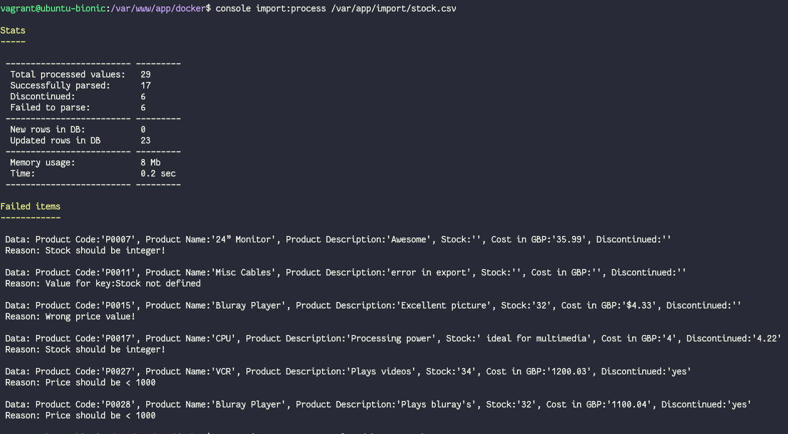

Implemented import is in `code/src/Import` and `code/src/Command/ImportCommand.php`.

Updated SQL: `files/make_database.sql`

Added fields are `intQuantity` and `dcmPrice`.

`dcmPrice` has type `decimal(10,2)` but depending on team developers it could be `int` (cents) and `100` will be equal to `1£`.

Command: `import:process <filename>`  
Where `filename` is path to a CSV file.  
Optional could be used with `--dry` option. In this case only parsing will be performed without changes in DB.

Example of usage:  

